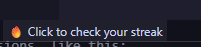
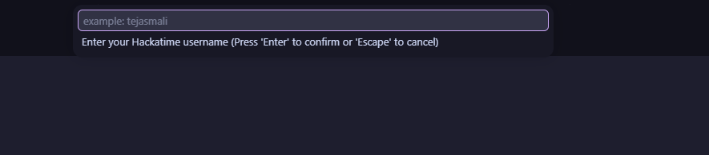
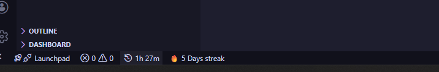
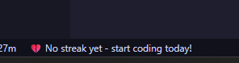

# Hackatime Stats

Show your Hackatime streak directly in the VS Code status bar.
(I will add more stats in future)

## Features
- Status bar item with streak text
- Command: `Hackatime: Show Streak`
- Friendly fallback when no streak is available

## Usage
1. Run command `Hackatime: Show Streak`or you can click on this shown below   

 

2. Enter your Hackatime username
 

3. View streak in popup and status bar

## API Used
- `GET https://hackatime.hackclub.com/api/v1/users/{username}/stats`

## Notes
- No API key required in this version
- If user is not found, the extension shows an error message

## This is some Images

